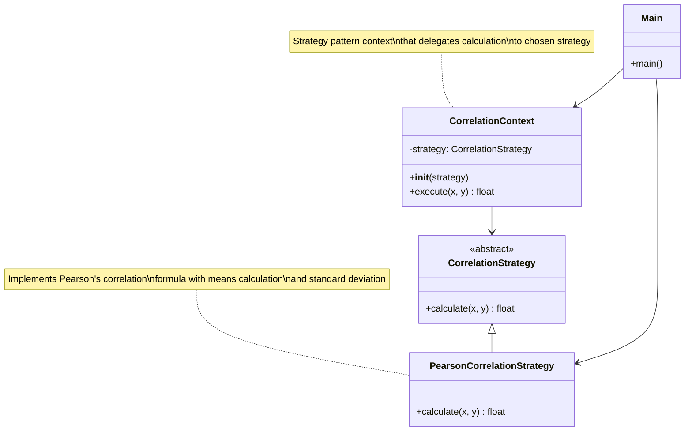
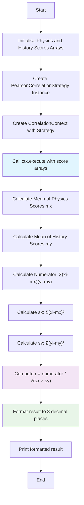

# Pearson Correlation Coefficient Calculator

## Overview
This program calculates Karl Pearson's coefficient of correlation between two sets of test scores and outputs the result rounded to three decimal places.

## Problem Description
Given test scores for 10 students in Physics and History, compute the correlation coefficient to measure the linear relationship between performance in these two subjects.

### Sample Data
```
Physics Scores: 15  12   8   8   7   7   7   6   5   3
History Scores: 10  25  17  11  13  17  20  13   9  15
```

## Formula
The Pearson correlation coefficient is calculated using:

```
r = Σ(xi - x̄)(yi - ȳ) / √[Σ(xi - x̄)² × Σ(yi - ȳ)²]
```

Where:
- **r** is Pearson's correlation coefficient
- **xi** and **yi** are the individual sample points
- **x̄** and **ȳ** are the means of the x and y values
- **n** is the number of data points

## Output Requirements
- Print the correlation coefficient as a floating-point value
- Round to exactly three decimal places
- No leading or trailing spaces
- Format example: `0.255` (this is just a format example, not the actual answer)

## Testing Instructions
1. To test your code implementation:
   - Choose "Test against custom input"
   - Enter any value in the input box (e.g., 'x')
   - The code will not run without some input value
2. When satisfied with the output, press "Submit Code"

## Implementation Notes
- The correlation coefficient ranges from -1 to +1
- Values close to +1 indicate strong positive correlation
- Values close to -1 indicate strong negative correlation
- Values close to 0 indicate weak or no linear correlation
- Ensure proper handling of floating-point precision for the three decimal place requirement

## Expected Workflow
1. Read or initialise the Physics and History score arrays
2. Calculate the means of both datasets
3. Compute the numerator: sum of products of deviations
4. Compute the denominator: square root of the product of sum of squared deviations
5. Calculate the correlation coefficient
6. Round to three decimal places and output

## Architecture Overview

The implementation uses the Strategy design pattern to provide flexibility for different correlation calculation methods:



## Program Flow



## File Structure
```
├── main.py              # Entry point with test data
├── correlation.py       # Strategy pattern implementation
└── README.md           # This documentation
```

## Mathematical Concepts
This exercise demonstrates:
- Statistical correlation analysis using Strategy design pattern
- Object-oriented programming principles (ABC, inheritance)
- Data processing and mathematical computation
- Precision handling in numerical calculations
- Application of Pearson's correlation formula in practice